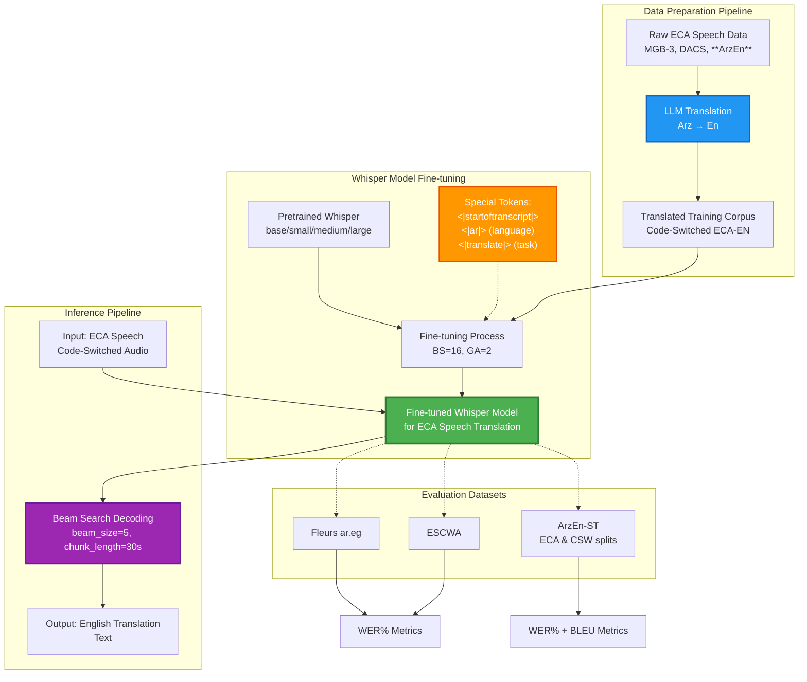

# Arz to En Speech-to-Text Translation <!-- omit in toc -->

[](https://opensource.org/licenses/MIT)
[](https://www.python.org/)
[](https://pytorch.org/)
[](https://github.com/huggingface/transformers)
[](https://github.com/openai/whisper)

## Table of contents <!-- omit in toc -->

- [Publications \& Presentation](#publications--presentation)
- [Getting Started](#getting-started)
- [Paper Structure](#paper-structure)
- [Cascaded Models: Evaluation and Analysis](#cascaded-models-evaluation-and-analysis)
  - [ArzEn-ST: A Three-way Speech Translation Corpus for Code-Switched Egyptian Arabic - English](#arzen-st-a-three-way-speech-translation-corpus-for-code-switched-egyptian-arabic---english)
  - [ArzEn-LLM: Code-Switched Egyptian Arabic-English Translation and Speech Recognition Using LLMs](#arzen-llm-code-switched-egyptian-arabic-english-translation-and-speech-recognition-using-llms)
- [Proposed Methodology](#proposed-methodology)
- [Training and Evaluation Datasets](#training-and-evaluation-datasets)
  - [Training Datasets](#training-datasets)
  - [Evaluation Datasets](#evaluation-datasets)
- [Whisper Model Fine-tuning and Evaluation](#whisper-model-fine-tuning-and-evaluation)
- [Whisper Model Evaluations](#whisper-model-evaluations)
  - [Reported Zero-shot Whisper Paper Model Evaluations](#reported-zero-shot-whisper-paper-model-evaluations)
  - [Personal Zero-shot Whisper Model Evaluations](#personal-zero-shot-whisper-model-evaluations)
  - [Fine-tuned Whisper Model Evaluations](#fine-tuned-whisper-model-evaluations)
  - [Model Comparison](#model-comparison)
  - [Metric Comparison](#metric-comparison)
- [Environment, Requirements and Dependencies](#environment-requirements-and-dependencies)
- [References](#references)
  - [Project Artifacts (Research Paper and Presentation)](#project-artifacts-research-paper-and-presentation)
  - [Core Speech \& Translation Datasets](#core-speech--translation-datasets)
  - [Literature Survey](#literature-survey)
  - [Arabic Speech \& NLP Data Repositories](#arabic-speech--nlp-data-repositories)
  - [Arabic \& Multilingual LLM Benchmarks](#arabic--multilingual-llm-benchmarks)
  - [Translation-Focused LLMs](#translation-focused-llms)
  - [Tooling \& Utilities](#tooling--utilities)

## Publications & Presentation

For a deeper dive into our work, you can explore the full paper and the accompanying presentation:

- **Paper:** [ArzEn-E2E: Advancing End-to-End Speech Translation for Egyptian Arabic](https://www.overleaf.com/project/6929db0402a08f0749b23518)  
  A detailed study presenting the methodology, experiments, and results of our end-to-end speech translation model for Egyptian Arabic.

- **Presentation:** [ArzEn-E2E Presentation I](https://docs.google.com/presentation/d/1OPavZytVxQzuSJCRFDDU1AJSZH5qNmuwO9KC1nZS-fA/edit?slide=id.p#slide=id.p)  
  A concise overview highlighting the key contributions, model architecture, and evaluation outcomes.
- **Presentation:** [ArzEn-E2E Presentation II](https://docs.google.com/presentation/d/1QxnYi9oPT-tb6eUJUNv7pu1k-aX3J2zmDgXv39ZpHGw/edit?slide=id.p#slide=id.p)  
  A concise overview highlighting previous work.

**Correspondence:**

Ibrahim Amin **(Corresponding author)** – *[IbrahimAmin532@gmail.com](mailto:IbrahimAmin532@gmail.com)* \
Dr. Waleed – *[waleed@aast.edu](mailto:waleed@aast.edu)* \
Dr. Fahima – *[fahima@aast.edu](mailto:fahima@aast.edu)* \
Dr. Wesam – *[w.askar@adj.aast.edu](mailto:w.askar@adj.aast.edu)*

## Getting Started

> Train an Arz-En speech-to-text translation (S2TT) model using LLM-translated, Egyptian Colloquial Arabic (ECA) code-switched, labeled speech datasets.

The goal is to produce:

1. A **high-quality LLM-translated, Egyptian Colloquial Arabic (ECA) code-switched, labeled speech dataset**
1. A **high-quality S2TT model** suitable for:
   1. Introducing the **first open-source, high-quality end-to-end (E2E) S2TT model** for the ECA dialect.
   1. Delivering an **efficient model that performs well in low-resource environments**.

## Paper Structure

The paper is organized as follows:

1. **Abstract** – A concise summary of the problem, methodology, and key findings.
2. **Introduction** – Provides context, motivation, and objectives of the study.
3. **Literature Survey** – Reviews related work and includes comparative tables where relevant.
4. **Background** – Describes theoretical foundations and necessary concepts.
5. **Proposed Model** – Details the methodology, algorithms, and system design.
6. **Results** – Presents experimental outcomes, evaluations, and performance analysis.
7. **Discussion** – Interprets the results, highlights implications, and compares with existing approaches.
8. **Conclusion** – Summarizes contributions and key takeaways.
9. **Future Work** – Suggests directions for further research.
10. **References** – Lists all cited works in Springer-compliant format.

## Cascaded Models: Evaluation and Analysis

### ArzEn-ST: A Three-way Speech Translation Corpus for Code-Switched Egyptian Arabic - English

| **Aspect**       | **Details**                                                                                                                                                                                                                                                                                                                                                                                                                                                                                                                                                                                                                                                                                                                |
| ---------------- | -------------------------------------------------------------------------------------------------------------------------------------------------------------------------------------------------------------------------------------------------------------------------------------------------------------------------------------------------------------------------------------------------------------------------------------------------------------------------------------------------------------------------------------------------------------------------------------------------------------------------------------------------------------------------------------------------------------------------- |
| **Paper Info**   | Hamed, I., Habash, N., Abdennadher, S., & Vu, N. T. (2022). "ArzEn-ST: A Three-way Speech Translation Corpus for Code-Switched Egyptian Arabic-English." WANLP 2022.                                                                                                                                                                                                                                                                                                                                                                                                                                                                                                                                                       |
| **Objective**    | Extend ArzEn speech corpus with translations in both directions (CS→Egyptian Arabic and CS→English) to create a three-way parallel ST corpus for training and evaluating ASR, MT, and ST systems.                                                                                                                                                                                                                                                                                                                                                                                                                                                                                                                          |
| **Methodology**  | - **Data**: Extended original ArzEn corpus (12 hours, 6,216 sentences)<br>- **Translation**: Manual translation by bilingual professionals with comprehensive guidelines<br>  - General rules (GR): intended meaning, handle difficult segments, abbreviation handling<br>  - Speech rules (SR): preserve style/disfluencies, maintain punctuation, mark partial words<br>  - CS rules (CSWR): handle borrowed words, allow rewrites for fluency, manage repetitions<br>- **Baselines**:<br>  - **ASR**: Joint CTC/attention E2E with ESPnet, 12/6 Transformer blocks, SpecAugment<br>  - **MT**: Fairseq Transformer (5 encoder/decoder layers, 512 dim), BPE tokenization<br>  - **ST**: Cascaded (ASR→MT)               |
| **Dataset**      | - **Core**: ArzEn-ST 12 hours (train: 3,344 sent., dev: 1,402 sent., test: 1,470 sent.)<br>- **Additional Training Data**:<br>  - ASR: Callhome, MGB-3, Librispeech (5h), MGB-2 (5h)<br>  - MT: 324k extra Egyptian Arabic-English parallel sentences from Callhome, LDC corpora (LDC2012T09, LDC2017T07, LDC2019T01, LDC2020T05), MADAR<br>- **CS Types**: Inter-sentential, extra-sentential, intra-sentential, intra-word, explicatory, elaboratory<br>- **Four representations** per utterance: audio, CS transcription, Egyptian Arabic translation, English translation                                                                                                                                              |
| **Result**       | **With ArzEn-ST only**:<br>- ASR: WER 57.9%, CER 36.2%<br>- MT CSW→En: BLEU 8.6<br>- MT CSW→Ar: BLEU 48.0<br>- ST CSW→En: BLEU 4.5<br>- ST CSW→Ar: BLEU 13.0<br><br>**With Extra training data**:<br>- ASR: WER 34.7%, CER 20.0% (40% WER reduction)<br>- MT CSW→En: BLEU 34.3 (300% improvement)<br>- MT CSW→Ar: BLEU 79.8 (66% improvement)<br>- ST CSW→En: BLEU 16.5 (267% improvement)<br>- ST CSW→Ar: BLEU 31.1 (139% improvement)<br>- ST performance ~50% of MT (error propagation effect)                                                                                                                                                                                                                          |
| **Conclusion**   | Successfully created first three-way parallel CS speech translation corpus with naturalistic data. External training data crucial for low-resource CS tasks. Cascaded ST systems outperform limited E2E approaches in low-resource settings. Translation into primary language (Arabic) significantly easier than secondary language (English).                                                                                                                                                                                                                                                                                                                                                                            |
| **Research Gap** | - **Cascaded architecture only**: No end-to-end ST models developed or compared<br>- **Error propagation**: ~50% performance drop from MT to ST due to cascaded pipeline<br>- **No joint training**: ASR and MT components trained independently<br>- **Traditional architectures**: Uses older Transformer/RNN models, not modern pre-trained models like Whisper or large speech LLMs<br>- **Limited real-time capability**: Two-stage inference slower than potential E2E<br>- **No multimodal integration**: No joint audio-text representations<br>- **Small test set**: 1,470 sentences may not capture full CS complexity<br>- **No direct E2E baseline**: Cannot compare cascaded vs. E2E performance on same data |

### ArzEn-LLM: Code-Switched Egyptian Arabic-English Translation and Speech Recognition Using LLMs

| **Aspect**       | **Details**                                                                                                                                                                                                                                                                                                                                                                                                                                                                                                                                                   |
| ---------------- | ------------------------------------------------------------------------------------------------------------------------------------------------------------------------------------------------------------------------------------------------------------------------------------------------------------------------------------------------------------------------------------------------------------------------------------------------------------------------------------------------------------------------------------------------------------- |
| **Paper Info**   | Heakl, A., Zaghloul, Y., Ali, M., Hossam, R., & Gomaa, W. (2024). "ArzEn-LLM: Code-Switched Egyptian Arabic-English Translation and Speech Recognition Using LLMs." Procedia Computer Science.                                                                                                                                                                                                                                                                                                                                                                |
| **Objective**    | Develop MT and ASR systems for code-switched Egyptian Arabic-English using large language models, with cascaded speech-to-text translation pipeline.                                                                                                                                                                                                                                                                                                                                                                                                          |
| **Methodology**  | - **MT**: Fine-tuned LLaMa2 7B, LLaMa3 8B, Gemma1.1 2B/7B using DoRA adapters with int4 quantization<br>- **ASR**: Fine-tuned Whisper (Small, Medium) models<br>- **ST**: Cascaded system (ASR → MT)<br>- Training: 2x T4 GPUs (16GB VRAM), paged-Adam optimizer, gradient checkpointing, gradient accumulation (step=4)<br>- Data preprocessing: removed URLs, emoticons, lowercase, resampling to 16kHz for audio                                                                                                                                           |
| **Dataset**      | - **Training**: ArzEn-ST (3,344 sentences) + ArzEn-MultiGenre parallel corpora<br>- **Test**: ArzEn-ST test set (1,402 sentences)<br>- Additional pre-training on larger parallel datasets (song lyrics, novels, subtitles)                                                                                                                                                                                                                                                                                                                                   |
| **Result**       | - **MT CSW→En**: LLaMa3 8B achieved BLEU 53.64 (+56% over SOTA 8.6), BERT-F1 81.1%, METEOR 0.62<br>- **MT CSW→Ar**: LLaMa3 8B achieved BLEU 87.2 (+9.3% over SOTA 79.8), BERT-F1 98.8%<br>- **ASR**: Whisper Medium WER 31.1% (-11.6% from SOTA 34.7%), CER 12.0%<br>- **Human Evaluation**: 9.2/10 rating for translation quality<br>- **Quantization**: Q5 model (68.75% size reduction) with only 1-1.2% performance degradation, 5.6GB footprint, 7.2 tokens/sec throughput                                                                               |
| **Conclusion**   | LLMs with adapter-based fine-tuning achieve significant improvements in code-switched MT and ASR. Cascaded ST systems viable for low-resource settings. Quantized models enable deployment on consumer hardware for real-time applications.                                                                                                                                                                                                                                                                                                                   |
| **Research Gap** | - **Cascaded system limitations**: Two-stage pipeline introduces error propagation from ASR to MT<br>- **No end-to-end speech translation**: Direct audio→text translation not explored<br>- **Limited real-time performance**: Cascaded approach has higher latency than potential E2E models<br>- **No joint optimization**: ASR and MT trained separately without shared representations<br>- **Inference inefficiency**: Two model calls required (ASR then MT) vs. single E2E model<br>- Translation quality depends on ASR accuracy (error compounding) |

## Proposed Methodology



## Training and Evaluation Datasets

### Training Datasets

- MGB-3
- DACS
- Arzen-ST train set

### Evaluation Datasets

- Fleurs
- ESCWA
- Arzen-ST Test set

## Whisper Model Fine-tuning and Evaluation

```bash
cd src/

# Single-GPU Fine-tuning
python whisper_finetuning.py -m /path/to/pretrained-whisper-model -d {mgb3,dacs,arzen-st} -s /path/to/save/finetuned-whisper-model

# Whisper Model Evaluation
python whisper_evaluation.py --dataset-name {fleurs,escwa,arzen-st} --model-path /path/to/whisper-model
```

## Whisper Model Evaluations

### Reported Zero-shot Whisper Paper Model Evaluations

|      Model       | Parameters | Fleurs ar.eg Arabic WER% |
| :--------------: | :--------: | :----------------------: |
|   Whisper tiny   |    39 M    |          63.4%           |
|   Whisper base   |    74 M    |          48.8%           |
|  Whisper small   |   244 M    |          30.6%           |
|  Whisper medium  |   769 M    |          20.4%           |
|  Whisper large   |   1550 M   |          18.1%           |
| Whisper large-v2 |   1550 M   |          16.0%           |
| Whisper large-v3 |   1550 M   |           9.6%           |

<div style="page-break-before:always"></div>

### Personal Zero-shot Whisper Model Evaluations

|                               Model                               | Fleurs ar.eg Arabic `(transcription column)` WER% |
| :---------------------------------------------------------------: | :-----------------------------------------------: |
|   `Whisper base (fp32) beam search decoding with beam size = 5`   |            `48.5006%` **(45.2559%)***             |
|               Whisper small (fp32) greedy decoding                |                      32.40%                       |
|  `Whisper small (fp32) beam search decoding with beam size = 5`   |             `30.29%` **(26.1173%)***              |
|   Whisper small (fp16) beam search decoding with beam size = 5    |                     30.2780%                      |
|               Whisper medium (fp32) greedy decoding               |                     21.8768%                      |
|  `Whisper medium (fp32) beam search decoding with beam size = 5`  |            `20.3957%` **(15.2309%)***             |
|   Whisper medium (fp16) beam search decoding with beam size = 5   |                     20.4564%                      |
| `Whisper large-v2 (fp16) beam search decoding with beam size = 5` |                    `15.9766%`                     |
| `Whisper large-v3 (fp16) beam search decoding with beam size = 5` |             `14.4834%` **(9.5255%)***             |

*: basic_normalizer = BasicTextNormalizer(**remove_diacritics=True**)

### Fine-tuned Whisper Model Evaluations

| Whisper Model Variant | Fine-tuning dataset(s) | Fine-tuning Hyperparameters |         Inference Hyperparameters         | Fleurs ar.eg testset^ WER% | ESCWA WER% | Arzen ECA WER% | Arzen CSW WER% | Arzen BLEU% |
| :-------------------: | :--------------------: | :-------------------------: | :---------------------------------------: | :------------------------: | :--------: | :------------: | :------------: | :---------: |
|         base          |       Zero-shot        |              -              | (fp32) BSD, beam_size=5, chunk_length=30s |           48.50%           |  140.76%   |     XX.XX%     |     XX.XX%     |   XX.XX%    |
|         small         |       Zero-shot        |              -              | (fp32) BSD, beam_size=5, chunk_length=30s |           30.29%           |   98.15%   |     XX.XX%     |     XX.XX%     |   XX.XX%    |
|         base          | Translated MGB-3/DACS  |       (BS=16 & GA=2)*       | (fp32) BSD, beam_size=5, chunk_length=30s |           XX.XX%           |   XX.XX%   |     XX.XX%     |     XX.XX%     |   XX.XX%    |
|         small         | Translated MGB-3/DACS  |       (BS=16 & GA=2)*       | (fp32) BSD, beam_size=5, chunk_length=30s |           XX.XX%           |   XX.XX%   |     XX.XX%     |     XX.XX%     |   XX.XX%    |

---

### Model Comparison

| Model                      | Configuration    | ASR (WER) | MT (BLEU) | S2TT (BLEU) | S2TT vs MT Gap     |
| -------------------------- | ---------------- | --------- | --------- | ----------- | ------------------ |
| ESPnet ASR → Fairseq MT    | ArzEn-ST only    | 57.9%     | 8.6       | 4.5         | -48% performance   |
| ESPnet ASR → Fairseq MT    | ArzEn-ST + Extra | 34.7%     | 34.3      | 16.5        | -52% performance   |
| Whisper Medium → LLaMa3 8B | ArzEn-ST + Extra | 31.1%     | 53.64     | 29.5        | −45.0% performance |

---

### Metric Comparison

| Metric    | ArzEn-ST (2022) | E2E Approach (Whisper Small) (2025) | Improvement   | ArzEn-LLM (2024) |
| --------- | --------------- | ----------------------------------- | ------------- | ---------------- |
| ASR WER   | 34.7%           | 33.0%                               | +5% better    | 31.1% (best)     |
| S2TT BLEU | 16.5            | 24.6                                | +49.1% better | 29.5% (best)     |

<div style="page-break-before:always"></div>

`NOTES`:

- All **WER% scores** are calculated after **reference and hypothesis text normalization** using ```whisper.normalizers.BasicTextNormalizer```.
- *: All other Hyperparameters are unchanged in the python fine-tuning script `(src/whisper_finetuning.py)`.
- ^: Provided Normalized `transcription` column is used instead of `raw_transcription` column.

## Environment, Requirements and Dependencies

- Ubuntu 24.04
- NVIDIA RTX 4060 Ti 16GB CUDA-Enabled GPU
- NVIDIA Drivers 595.58.03
- PyTorch 2.6.0 + CUDA Toolkit 12.4

```bash
sudo apt update && sudo apt upgrade -y
sudo apt install ffmpeg cmake gcc libboost-dev build-essential gcc-multilib g++-multilib python3-dev zlib1g-dev

conda create -n arzen python=3.10 -y
conda activate arzen

python -m pip install --upgrade pip
pip install -r requirements.txt
```

## References

### Project Artifacts (Research Paper and Presentation)

- [ArzEn-E2E: Advancing End-to-End Speech Translation for Egyptian Arabic](https://www.overleaf.com/project/6929db0402a08f0749b23518)
- [ArzEn-E2E: Advancing End-to-End Speech Translation for Egyptian Arabic Presentation](https://docs.google.com/presentation/d/1-vVKJsEQ59G4NaCPfwJ7EiEfvRK2tsHbqS5wwKmGosw/edit?slide=id.p#slide=id.p)

### Core Speech & Translation Datasets

- [MohamedRashad/MGB-3-Arabic](https://huggingface.co/datasets/MohamedRashad/MGB-3-Arabic)
- [DACS](https://github.com/qcri/Arabic_speech_code_switching)
- [google/fleurs](https://huggingface.co/datasets/google/fleurs)
- [QCRI/escwa](https://huggingface.co/datasets/QCRI/escwa)
- [ArzEn Speech Corpus](https://www.kaggle.com/datasets/ahmedsamehahmed/arzen-speechcorpus-dataset)
- [ArzEn-ST Corpus](https://sites.google.com/view/arzen-corpus/resources)

### Literature Survey

- [Robust Speech Recognition via Large-Scale Weak Supervision](https://arxiv.org/abs/2212.04356)
- [Speech Recognition Challenge in the Wild: Arabic MGB-3](https://arxiv.org/abs/1709.07276)
- [Effects of Dialectal Code-Switching on Speech Modules: A Study Using Egyptian Arabic Broadcast Speech](https://www.isca-archive.org/interspeech_2020/chowdhury20c_interspeech.html)
- [FLEURS: Few-shot Learning Evaluation of Universal Representations of Speech](https://arxiv.org/abs/2205.12446)
- [Arabic Code-Switching Speech Recognition using Monolingual Data](https://arxiv.org/abs/2107.01573)
- [ArzEn: A Speech Corpus for Code-switched Egyptian Arabic-English](https://aclanthology.org/2020.lrec-1.523/)
- [ArzEn-ST: A Three-way Speech Translation Corpus for Code-Switched Egyptian Arabic - English](https://arxiv.org/abs/2211.12000)
- [ArzEn-LLM: Code-Switched Egyptian Arabic-English Translation and Speech Recognition Using LLMs](https://arxiv.org/abs/2406.18120)
- [ArzEn-MultiGenre: An aligned parallel dataset of Egyptian Arabic song lyrics, novels, and subtitles, with English translations](https://arxiv.org/abs/2508.01411)

### Arabic Speech & NLP Data Repositories

- [Mohamed Rashad Arabic Speech Datasets](https://huggingface.co/collections/MohamedRashad/arabic-speech-datasets)
- [QCRI Speech Corpus](https://huggingface.co/collections/ArabicSpeech/qcri-speech-corpus)
- [ARABIC NLP DATA CATALOGUE MASADER](https://arbml.github.io/masader/)

### Arabic & Multilingual LLM Benchmarks

- [silma-ai/Arabic-LLM-Broad-Leaderboard](https://huggingface.co/spaces/silma-ai/Arabic-LLM-Broad-Leaderboard)
- [OALL/Open-Arabic-LLM-Leaderboard](https://huggingface.co/spaces/OALL/Open-Arabic-LLM-Leaderboard)
- [Omartificial-Intelligence-Space/Arabic-MMMLU-Leaderborad](https://huggingface.co/spaces/Omartificial-Intelligence-Space/Arabic-MMMLU-Leaderborad)
- [Navid-AI/The-Arabic-RAG-Leaderboard](https://huggingface.co/spaces/Navid-AI/The-Arabic-RAG-Leaderboard)
- [MohamedRashad/arabic-tokenizers-leaderboard](https://huggingface.co/spaces/MohamedRashad/arabic-tokenizers-leaderboard)
- [LMArena](https://lmarena.ai/leaderboard)

### Translation-Focused LLMs

- [Command-A-Translate: Raising the Bar of Machine Translation with Difficulty Filtering](https://aclanthology.org/2025.wmt-1.55/)
- [Seed-X: Building Strong Multilingual Translation LLM with 7B Parameters](https://arxiv.org/abs/2507.13618)
- [TranslateGemma Technical Report](https://arxiv.org/pdf/2601.09012)
- [TranslateGemma Technical Blog](https://blog.google/innovation-and-ai/technology/developers-tools/translategemma/)
- [TranslateGemma Ollama](https://ollama.com/library/translategemma)

### Tooling & Utilities

- [Fix your Right-to-Left (RTL) text when you mix it with Left-to-Right (LTR) text](https://fixtxt.co/)
- [Convert Mermaid Diagrams to High-Quality PNG Images](https://www.mermaidonline.live/mermaid-to-png)
